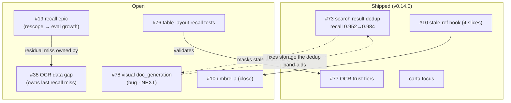
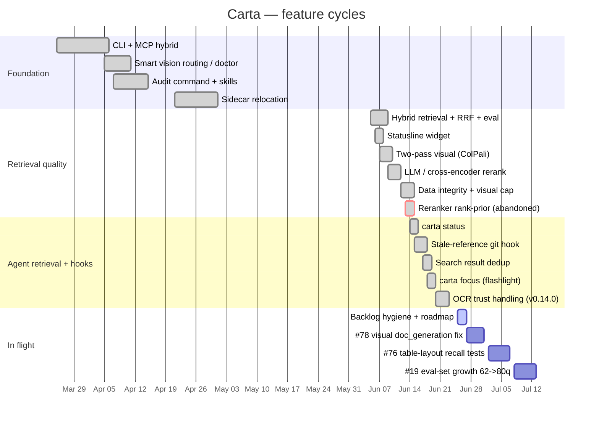

# Carta Roadmap

> **Two trackers, two jobs.** This file is the **durable, relational view** — the arc of the project and how current work connects — meant to orient any new session (human or agent) straight from the repo. The **live operational board** is **GitHub Projects → "Carta Roadmap"** (status, owner, target dates, the Roadmap/timeline view). Issues are the source of truth for *what's open*; this file is the source of truth for *how it all relates and where it's headed*.
>
> Keep them in sync at release boundaries. The doc backlog lives in [`BACKLOG/TRIAGE.md`](BACKLOG/TRIAGE.md); audit findings in [`AUDIT_REPORT.md`](AUDIT_REPORT.md).

**Current release:** v0.14.0 (OCR trust handling) · **Retrieval:** hybrid recall@5 **0.984** (61/62 on the 62-query ET-embed eval).

---

## Now / Next / Later

| Horizon | Item | Why |
|---|---|---|
| **Now** | Backlog hygiene (this cycle) | Reconcile bookkeeping to shipped reality: Audit #2 done, repo cleaned, roadmap + Project stood up. |
| **Next** | **#78** — visual ColPali points lack `doc_generation` → orphan on re-embed | The one genuine, ready, self-contained engineering task. Removes the storage-integrity risk the #73 search-dedup *band-aid* currently masks. Effort M. |
| **Next** | Close **#10** (shipped) and rescope/close **#19** | Both are "open" only on paper — see below. Clears triage so the board reflects reality. |
| **Later** | **#76** — recall tests for complex table layouts | Validates the already-shipped #77 OCR trust tiers. Data-gathering heavy; can escalate to code if a layout class mis-extracts. |
| **Later** | **#19 (rescoped)** — grow the ET-embed eval 62→~80q | The only way to re-expose whether any first-stage recall lever is still worth pulling on a now-saturated corpus. |
| **Later** | Doc backlog DOC-011…DOC-017 | Audit #2 findings; mostly small. DOC-012 (README missing `carta_focus`) is the one error-severity item. |

### Why #19 and #10 are not live work
- **#19 (recall epic) — lever spent.** Across #35/#36/#37/contextual-headers/#73-dedup, hybrid recall@5 climbed 0.790→**0.984**. The reranker rank-prior experiment ([abandoned spec](superpowers/specs/2026-06-13-reranker-rank-prior-design.md)) proved the residual misses are **not** chunking/embedding — the sole remaining miss (patent US-11965795) is an OCR **data gap owned by #38**. The eval is too saturated to measure further levers. → close as delivered, or rescope to eval-growth.
- **#10 (stale-ref umbrella) — shipped, never closed.** All four slices merged (#66/#67/#68 + the existing recall hook). Only the CI-annotations sub-item is deferred (needs a graph-accessible runner that doesn't exist). → close, optionally spin out the CI item.

---

## How current work relates

---

## Development arc

> The gantt dates after "In flight" are planning estimates, not commitments. Regenerate the historical sections from `docs/superpowers/{specs,plans}/` frontmatter (`date` / `status`) as the corpus grows.
