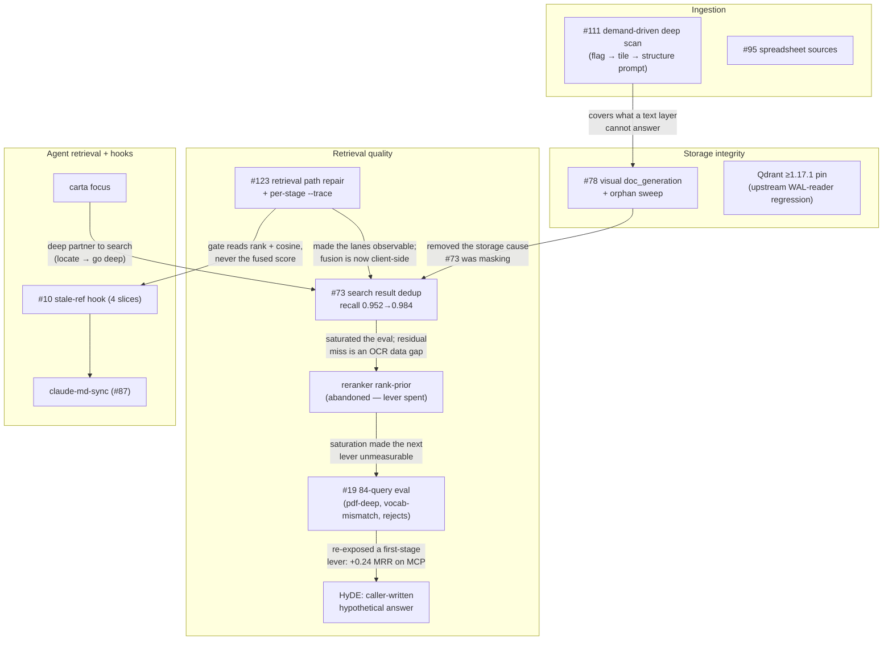
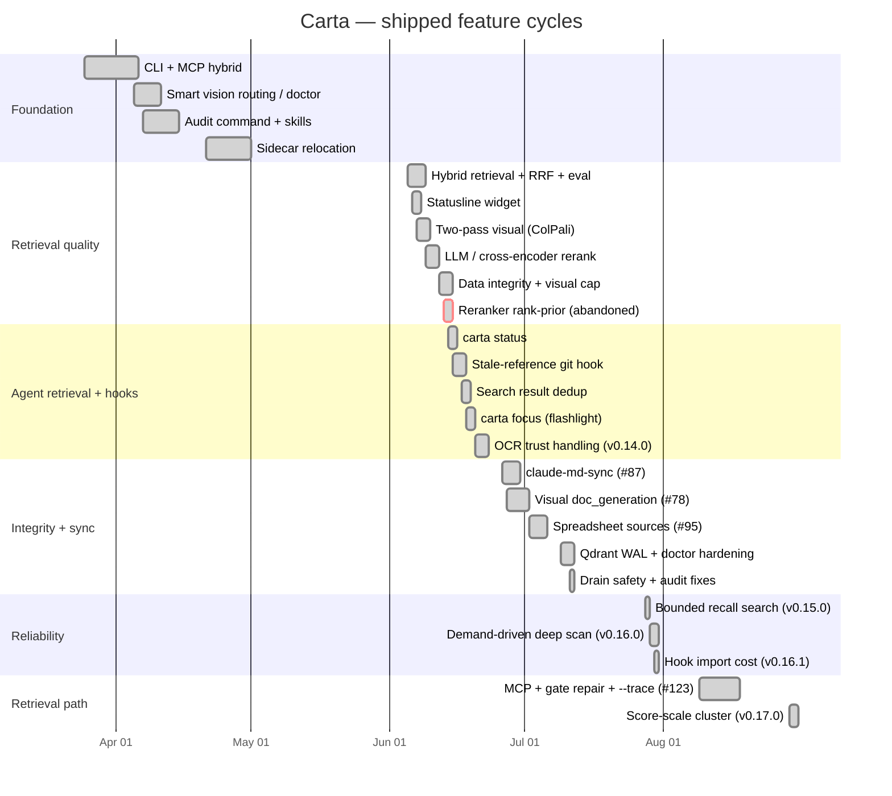

# Carta Roadmap

> **This file holds no status.** What is open, what it is sized at, and what blocks what all live on
> the **[Carta Roadmap board](https://github.com/users/Ian-q/projects/4)** — issues are the source of
> truth for *what is open*, and the board for *where it sits*. This file is the durable relational
> view: how the subsystems fit together and why the project went the way it did. If a sentence here
> would become false when an issue closes, it belongs on the board instead.
>
> The doc backlog lives in [`BACKLOG/TRIAGE.md`](BACKLOG/TRIAGE.md); audit findings in
> [`AUDIT_REPORT.md`](AUDIT_REPORT.md).

**Current release:** v0.17.0.
**Retrieval:** on the 84-query ET-embed eval built not to saturate (#19): hybrid recall@5 **0.655** /
MRR 0.554 (CLI); MCP dense-only MRR 0.463 → **0.698** with a caller-written hypothetical (HyDE). The
retired 62-query set had saturated at 0.984.

---

## How the subsystems relate

## Design rationale worth keeping

These outlive any individual issue, and are the things a fresh session most often needs to *not*
re-derive.

- **Score scales are not interchangeable, and Carta carries four.** A chunk can be ranked by dense
  cosine (0–1), by BM25, by *two different* RRF layers (intra-collection at `rrf_k`, then
  cross-collection fusion), and — in the visual lane — by ColPali MaxSim, a sum over query tokens
  that runs an order of magnitude higher than any cosine. Numbers from different layers look alike
  and compare meaninglessly. Every retrieval bug found so far has been a version of this: a
  threshold calibrated for cosine applied to RRF, or a merge that sorted MaxSim against cosine. When
  touching retrieval, name which scale a number is on before comparing it to anything.
- **Hence: rank for agreement, cosine for relevance.** The proactive-recall gate deliberately reads
  two different signals for two different questions. Rank is relative to the result set and says
  nothing about whether the query was answered — `hits[0]` always ranks well among the results,
  however bad they all are. The dense lane's raw cosine is the only absolute measure available. The
  asymmetry is load-bearing: a sparse-only top hit has no cosine and is *judged*, never silenced,
  because silently dropping it is the original defect.
- **A gate zone that cannot be reached is worse than a missing gate.** The first version of that
  gate had a structurally unreachable "silent" branch — a hit deep in both lanes can never be the
  fusion argmax, so the branch guarding against it never ran. It read as defensive and was inert.
  Reachability of every branch is now proven by tests driving real fusion output through the real
  gate.
- **A saturated eval hides levers; the fix was harder questions, not more of them.** Across
  #35/#36/#37, contextual headers, and the #73 dedup, hybrid recall@5 climbed 0.790 → 0.984 on the
  62-query set, and the reranker rank-prior experiment
  ([abandoned spec](superpowers/specs/2026-06-13-reranker-rank-prior-design.md)) found no chunking or
  embedding problem left. The rebuilt 84-query set asks what the old one did not — answers buried in
  long PDFs, questions sharing no vocabulary with their answer, design rationale, and `reject` hard
  negatives — and baseline recall@5 fell to 0.655. That headroom is what made HyDE measurable.
- **HyDE belongs to the caller, not to Carta.** Blending a *plausible* answer into the dense query
  vector is a large win when a frontier model writes it (MCP MRR +0.24), and no win when a local
  9b does — so the hypothetical is an argument, never something Carta generates. The blend keeps
  the question in the vector (`mean`, not hypothetical-only): the three Claude variants tie within
  noise, but `mean` has the fewest regressions and is the only 9b variant whose CI stays above zero —
  it degrades gracefully when the hypothetical is poor. **A wrong answer is not a usable anchor:** dense embeddings encode topic, not truth, so
  "the bus runs at 250 kbps" and "…500 kbps" embed together; subtracting a wrong answer is
  neutral-to-harmful and its opposite vector is simply off-topic (0/84 found, dense-only).
  [Spec with the full table](superpowers/specs/2026-09-21-hyde-hypothetical-query-design.md).
- **The Qdrant WAL corruption was upstream, not ours.** `wal.rs:150 Utf8Error` was a Qdrant 1.17.0
  WAL-reader regression (qdrant#8455), fixed in 1.17.1. The bind-mount/fsync theory was falsified —
  no data was ever lost, and quarantined collections replay clean on 1.17.1. Hence the image pin.
- **Judge model size is a per-surface decision, not a global one.** The proactive-recall hook blocks
  prompt submission, so its judge stays ≤2B. The stale-scan / claude-md supersession judge runs
  pre-push, so it deliberately uses a larger, higher-precision model.
- **The hook is on the latency budget of every prompt.** It blocks submission, so anything it
  imports is paid per prompt by every project. A single module-level import of a ColPali helper —
  read purely for a boolean — pulled in torch and cost ~3.1 s per prompt until v0.16.1. Imports on
  that path stay function-local, and a static AST test pins the invariant, because a runtime probe
  passes vacuously wherever torch is absent.
- **`carta focus` is the second half of a two-step.** `search` locates the file; `focus` goes deep
  inside one. Neither replaces the other.
- **Deep scanning is demand-driven because it cannot be afforded by default.** Tiling a page at
  300 dpi with two prompts per tile is not a cost every page can carry, so a document is *flagged*
  into that tier. The corollary is that a cost knob must never silently become a correctness switch
  — `colpali_scoped_paths` once gated OCR coverage as well as ColPali, so an out-of-scope PDF got
  zero visual coverage rather than merely no ColPali vectors.

## Development arc

> This gantt records **shipped** cycles only — planned work lives on the board, which is where dates
> and ordering can change without this file going stale. Regenerate the historical sections from
> `docs/superpowers/{specs,plans}/` frontmatter (`date` / `status`) as the corpus grows.
