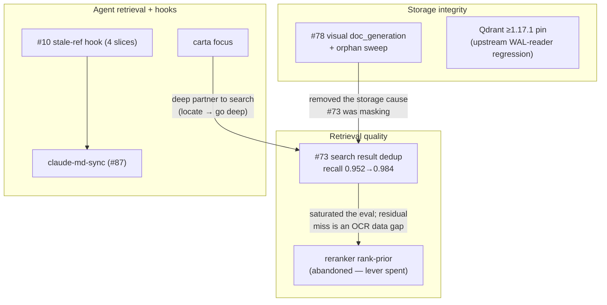
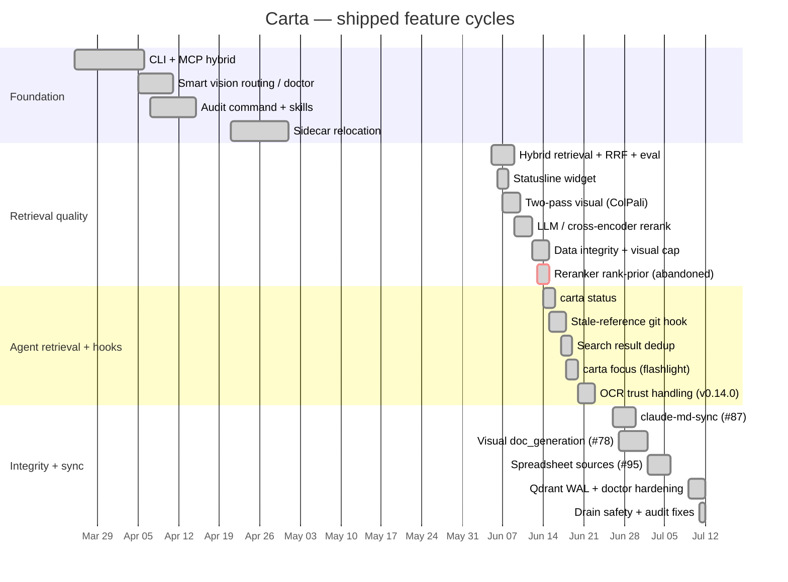

# Board Conventions + Cross-Worktree Session Board Implementation Plan

> **For agentic workers:** REQUIRED SUB-SKILL: Use superpowers:subagent-driven-development (recommended) or superpowers:executing-plans to implement this plan task-by-task. Steps use checkbox (`- [ ]`) syntax for tracking.

**Goal:** Make GitHub issues + Project #4 the single owner of status, strip status out of `docs/ROADMAP.md`, and give parallel worktrees a coordination surface.

**Architecture:** Four independent deliverables. Task 1 ports two bash scripts plus a `SessionStart` hook from ET-embed. Task 2 reconciles the board through `gh`. Tasks 3 and 4 rewrite documentation so the division of labor is written down where an agent will read it.

**Tech Stack:** bash, `gh` CLI 2.95+, GitHub Projects V2 GraphQL API. No Python, no new dependencies.

**Spec:** `docs/superpowers/specs/2026-07-18-board-conventions-design.md`

## Global Constraints

- Repo is `Ian-q/Carta`; working directory `/Users/ian/dev/doc-audit-cc`; default branch `main`.
- Project #4 "Carta Roadmap", node id `PVT_kwHOBiHnBs4BbnvS`.
- Field ids: Status `PVTSSF_lAHOBiHnBs4BbnvSzhWXBJM`, Area `PVTSSF_lAHOBiHnBs4BbnvSzhWXBOU`, Size `PVTSSF_lAHOBiHnBs4BbnvSzhWXBPM`.
- Option ids — Status: Todo `f75ad846`, In Progress `47fc9ee4`, Done `98236657`. Area: Retrieval `d57a6c32`, Vision/OCR `c41ee99c`, Hooks `edb641ba`, Docs `dbb4123e`, Infra `090168f4`. Size: S `5d0b976f`, M `ece80c7a`, L `4ecdf349`, XL `a1bbf668`.
- This repo is Carta-dogfooded (`.carta/` exists). The `SessionStart` hook must be **additive** — never remove or reorder Carta's own `UserPromptSubmit`/`Stop` hooks.
- Bash scripts must be `chmod +x` and always `exit 0` when run as a hook. A hook that aborts must not disrupt a session.
- **`docs/ROADMAP.md` may not contain per-issue status.** Any sentence that becomes false when an issue closes belongs on the board.

---

### Task 1: Port the cross-worktree session board

**Files:**
- Create: `.claude/hooks/active-board.sh`
- Create: `tools/session-task.sh`
- Modify: `.claude/settings.json` (currently `{}`)

**Interfaces:**
- Consumes: nothing from earlier tasks.
- Produces: `tools/session-task.sh` with three call forms — `tools/session-task.sh "<claim text>"` (claim), `tools/session-task.sh --clear` (release), `tools/session-task.sh` (print `working <claim>` or `unclaimed`). Board file at `<git-common-dir>/active-sessions.tsv`, rows `epoch \t worktree-path \t branch \t task`. Task 4 documents these.

- [ ] **Step 1: Create the hook script**

Create `.claude/hooks/active-board.sh`:

```bash
#!/usr/bin/env bash
# active-board.sh — Carta cross-worktree "live sessions" board.
#
# Wired as a SessionStart hook (see .claude/settings.json). On every session
# start it (1) records a heartbeat for the current worktree and (2) prints a
# board of every worktree that has had a session recently, with live git
# dirty-state, so parallel sessions can see what each other is working on.
#
# The board file lives in the shared git *common* dir (`git rev-parse
# --git-common-dir`), which resolves to the SAME absolute path from every
# linked worktree. So all worktrees read/write one board, and because it sits
# inside .git/ it is never committed and needs no .gitignore entry.
#
# Heartbeats older than TTL_SECONDS are forgotten. One entry per worktree
# (keyed by its root path) — re-running in the same worktree refreshes in place.
#
# Row format is `epoch \t worktree-path \t branch \t task`, where `task` is a
# free-text claim ("#97", "extension single-sourcing") set via
# tools/session-task.sh. A new session in a worktree INHERITS that worktree's
# existing claim rather than clearing it, on the theory that a worktree usually
# outlives one session.
#
# Stdout from a SessionStart hook is injected into the model's context, so this
# script just prints. It never reads stdin and always exits 0 (a hook that
# aborts must not disrupt a session). See CLAUDE.md "Cross-worktree session board".
set -u

TTL_SECONDS=$(( 12 * 60 * 60 ))   # forget a worktree's heartbeat after 12h idle

# Resolve the shared git common dir (identical absolute path from any worktree).
common_dir="$(git rev-parse --git-common-dir 2>/dev/null)" || exit 0
common_dir="$(cd "$common_dir" 2>/dev/null && pwd)" || exit 0
board="$common_dir/active-sessions.tsv"
main_wt="$(dirname "$common_dir")"

wt_root="$(git rev-parse --show-toplevel 2>/dev/null)" || exit 0
branch="$(git branch --show-current 2>/dev/null)"
[ -n "$branch" ] || branch="(detached@$(git rev-parse --short HEAD 2>/dev/null))"
now="$(date +%s)"

# Carry this worktree's existing task claim forward across the heartbeat.
task=""
if [ -f "$board" ]; then
  task="$(awk -F'\t' -v me="$wt_root" '$2 == me { t = $4 } END { print t }' "$board" 2>/dev/null)"
fi

# Rewrite the board: drop this worktree's prior line + any expired lines, then
# append a fresh heartbeat for this session. Atomic via temp-file + mv.
tmp="$board.tmp.$$"
{
  if [ -f "$board" ]; then
    awk -F'\t' -v me="$wt_root" -v now="$now" -v ttl="$TTL_SECONDS" \
      '($2 != me) && (($1 + 0) > 0) && ((now - $1) < ttl) { print }' "$board"
  fi
  printf '%s\t%s\t%s\t%s\n' "$now" "$wt_root" "$branch" "$task"
} > "$tmp" 2>/dev/null && mv -f "$tmp" "$board" 2>/dev/null
rm -f "$tmp" 2>/dev/null

[ -f "$board" ] || exit 0

# Render newest-first, recomputing live dirty-state per worktree.
printf '## Active Carta sessions (cross-worktree board)\n'
printf 'Worktrees with a session in the last 12h (the marker shows this session). Run `claude-mem:standup` for a deep cross-branch diff.\n'
printf 'Claim what this session is working on with `tools/session-task.sh "<issue or task>"` so other sessions do not pick it up.\n\n'

sort -t"$(printf '\t')" -k1,1nr "$board" | while IFS="$(printf '\t')" read -r ts path br task; do
  [ -n "$ts" ] || continue
  age=$(( now - ts ))
  if   [ "$age" -lt 90 ];    then ago="just now"
  elif [ "$age" -lt 3600 ];  then ago="$(( age / 60 ))m ago"
  elif [ "$age" -lt 86400 ]; then ago="$(( age / 3600 ))h ago"
  else                            ago="$(( age / 86400 ))d ago"
  fi

  if [ -d "$path" ]; then
    if [ -n "$(git -C "$path" status --porcelain 2>/dev/null)" ]; then state="dirty"; else state="clean"; fi
  else
    state="gone?"
  fi

  case "$path" in
    "$main_wt") label="(main)" ;;
    *)          label="${path#"$main_wt"/}" ;;
  esac

  if [ "$path" = "$wt_root" ]; then marker="▸ "; else marker="  "; fi

  if [ -n "$task" ]; then claim="working $task"; else claim="unclaimed"; fi

  printf '%s%-30s · %-5s · %-24s · %-26s · %s\n' "$marker" "$br" "$state" "$claim" "$label" "$ago"
done

exit 0
```

- [ ] **Step 2: Create the claim script**

Create `tools/session-task.sh`:

```bash
#!/usr/bin/env bash
# session-task.sh — claim what this worktree's session is working on.
#
# Writes the `task` column of the cross-worktree session board that
# .claude/hooks/active-board.sh prints at every SessionStart. The point is to
# stop two parallel sessions from independently starting the same issue; it is
# a claim, not a lock — nothing enforces it, and a stale claim is possible if a
# session dies. Treat the board as advisory and confirm with the human when a
# claim looks wrong.
#
# The board lives at <git-common-dir>/active-sessions.tsv, shared by every
# linked worktree and never committed. Rows are `epoch \t path \t branch \t task`.
#
#   tools/session-task.sh "#97 extension sets"   # claim
#   tools/session-task.sh --clear                # release
#   tools/session-task.sh                        # show this worktree's claim
#
# See CLAUDE.md "Cross-worktree session board".
set -eu

MAX_LEN=40   # keep the rendered board column narrow

common_dir="$(git rev-parse --git-common-dir 2>/dev/null)" || {
  echo "session-task: not inside a git repository" >&2; exit 1; }
common_dir="$(cd "$common_dir" && pwd)"
board="$common_dir/active-sessions.tsv"

wt_root="$(git rev-parse --show-toplevel)"
branch="$(git branch --show-current 2>/dev/null)" || branch=""
[ -n "$branch" ] || branch="(detached@$(git rev-parse --short HEAD))"

# No args: report the current claim and exit.
if [ "$#" -eq 0 ]; then
  current=""
  [ -f "$board" ] && current="$(awk -F'\t' -v me="$wt_root" '$2 == me { t = $4 } END { print t }' "$board")"
  if [ -n "$current" ]; then echo "working $current"; else echo "unclaimed"; fi
  exit 0
fi

if [ "$1" = "--clear" ]; then
  task=""
else
  # Tabs and newlines would corrupt the TSV; strip them, trim, then truncate.
  task="$(printf '%s' "$*" | tr -d '\t\n\r' | sed -e 's/^[[:space:]]*//' -e 's/[[:space:]]*$//' | cut -c "1-$MAX_LEN")"
fi

now="$(date +%s)"
tmp="$board.tmp.$$"
trap 'rm -f "$tmp"' EXIT

# Replace this worktree's task field in place, or append a row if it has none
# yet (e.g. the script ran before this worktree's first SessionStart hook).
awk -F'\t' -v OFS='\t' -v me="$wt_root" -v task="$task" -v now="$now" -v br="$branch" '
  $2 == me { print $1, $2, $3, task; found = 1; next }
  { print }
  END { if (!found) print now, me, br, task }
' "${board:-/dev/null}" 2>/dev/null > "$tmp" || : > "$tmp"

[ -s "$tmp" ] || printf '%s\t%s\t%s\t%s\n' "$now" "$wt_root" "$branch" "$task" > "$tmp"
mv -f "$tmp" "$board"
trap - EXIT

if [ -n "$task" ]; then
  echo "session-task: $branch is now working $task"
else
  echo "session-task: $branch claim cleared"
fi
```

- [ ] **Step 3: Make both executable**

Run:

```bash
chmod +x .claude/hooks/active-board.sh tools/session-task.sh
ls -l .claude/hooks/active-board.sh tools/session-task.sh
```

Expected: both lines begin `-rwxr-xr-x`.

- [ ] **Step 4: Wire the SessionStart hook**

`.claude/settings.json` is currently `{}`. Replace its whole contents with:

```json
{
  "hooks": {
    "SessionStart": [
      {
        "matcher": "",
        "hooks": [
          {
            "type": "command",
            "command": "bash -c 's=\"$(cd \"$(git rev-parse --git-common-dir 2>/dev/null)/..\" 2>/dev/null && pwd)/.claude/hooks/active-board.sh\"; [ -f \"$s\" ] && exec bash \"$s\"; exit 0'"
          }
        ]
      }
    ]
  }
}
```

The command resolves the script through the **main worktree's** copy via `git rev-parse --git-common-dir`, so every linked worktree runs the same script regardless of its own branch. Corollary to note during review: an edit to the hook only takes effect once it lands on the branch the main checkout has out.

If `.claude/settings.json` is no longer `{}` when you reach this step, merge the `SessionStart` key in rather than overwriting — do not disturb existing keys.

- [ ] **Step 5: Verify claim round-trip**

Run:

```bash
tools/session-task.sh "#97 extension sets"
tools/session-task.sh
tools/session-task.sh --clear
tools/session-task.sh
```

Expected, in order:

```
session-task: main is now working #97 extension sets
working #97 extension sets
session-task: main claim cleared
unclaimed
```

- [ ] **Step 6: Verify the hook renders**

Run:

```bash
bash .claude/hooks/active-board.sh; echo "exit=$?"
```

Expected: the `## Active Carta sessions` header, then one row containing `▸`, the branch `main`, and `(main)`. Last line `exit=0`.

- [ ] **Step 7: Verify cross-worktree visibility and the no-git case**

Run:

```bash
git worktree add /tmp/carta-board-check -b tmp/board-check >/dev/null 2>&1
git -C /tmp/carta-board-check rev-parse --show-toplevel >/dev/null
(cd /tmp/carta-board-check && bash .claude/hooks/active-board.sh)
```

Expected: two rows — `/tmp/carta-board-check` marked `▸` and the main checkout unmarked.

Then confirm the hook is safe outside a repo:

```bash
(cd /tmp && bash /Users/ian/dev/doc-audit-cc/.claude/hooks/active-board.sh; echo "exit=$?")
```

Expected: no output except `exit=0`.

Clean up:

```bash
git worktree remove /tmp/carta-board-check --force
git branch -D tmp/board-check
```

- [ ] **Step 8: Confirm the board file is untracked**

Run:

```bash
git status --porcelain | grep -c active-sessions.tsv
```

Expected: `0` — the file lives inside `.git/` and is invisible to status.

- [ ] **Step 9: Commit**

```bash
git add .claude/hooks/active-board.sh tools/session-task.sh .claude/settings.json
git commit -m "feat: cross-worktree session board (SessionStart hook + task claims)

Ported from ET-embed. Board lives at <git-common-dir>/active-sessions.tsv so
every linked worktree shares one file and it is never committed. Hook is
additive and leaves Carta's own dogfooded hooks untouched.

Co-Authored-By: Claude Opus 4.8 (1M context) <noreply@anthropic.com>"
```

---

### Task 2: Reconcile Project #4

**Files:** none — this task mutates GitHub state only.

**Interfaces:**
- Consumes: nothing from earlier tasks.
- Produces: board state that Task 3 and Task 4 describe in prose. No code artifacts.

- [ ] **Step 1: Verify #79 and #80 were actually delivered**

PR #91's title claims both, but it merged with no closing references. Read the diff before closing anything — the title is not evidence.

```bash
gh pr diff 91 --patch | head -200
```

Confirm two behaviours are present in the diff: a query-embedding failure surfacing as a distinct error rather than an empty result set (#79), and import reconciling the sidecar/status layer so `status`/`doctor` no longer report never-embedded (#80).

If either is absent, **stop and report** rather than closing that issue — leave it open, set its board fields in Step 4, and note the gap.

- [ ] **Step 2: Close the delivered issues**

Only for those confirmed in Step 1:

```bash
gh issue close 79 --comment "Delivered in #91 (merged 2026-07-02); the PR declared no closing reference, so this stayed open. Verified against the merged diff."
gh issue close 80 --comment "Delivered in #91 (merged 2026-07-02); the PR declared no closing reference, so this stayed open. Verified against the merged diff."
```

Verify:

```bash
gh issue view 79 --json state --jq .state
gh issue view 80 --json state --jq .state
```

Expected: `CLOSED` twice.

- [ ] **Step 3: Add the `Embed` option to the Area field**

**Trap:** `singleSelectOptions` **replaces the entire option list**. Passing only `Embed` silently destroys the other five and orphans every item using them. All six must be sent.

```bash
gh api graphql -f query='
mutation {
  updateProjectV2Field(input: {
    fieldId: "PVTSSF_lAHOBiHnBs4BbnvSzhWXBOU",
    singleSelectOptions: [
      {name: "Retrieval",  color: GRAY, description: ""},
      {name: "Vision/OCR", color: GRAY, description: ""},
      {name: "Hooks",      color: GRAY, description: ""},
      {name: "Docs",       color: GRAY, description: ""},
      {name: "Infra",      color: GRAY, description: ""},
      {name: "Embed",      color: GRAY, description: ""}
    ]
  }) {
    projectV2Field {
      ... on ProjectV2SingleSelectField { options { id name } }
    }
  }
}'
```

Expected: six options returned. **Record the printed option ids** — the mutation may reissue them, so the `Embed` id (and possibly others) must be read from this output rather than assumed from the Global Constraints list.

- [ ] **Step 4: Backfill every open issue with its fields**

Re-read the Area option ids from Step 3's output, then run:

```bash
PROJECT_ID=PVT_kwHOBiHnBs4BbnvS
AREA_FIELD=PVTSSF_lAHOBiHnBs4BbnvSzhWXBOU
SIZE_FIELD=PVTSSF_lAHOBiHnBs4BbnvSzhWXBPM
STATUS_FIELD=PVTSSF_lAHOBiHnBs4BbnvSzhWXBJM
STATUS_TODO=f75ad846

# Paste the Embed option id printed by Step 3:
AREA_EMBED=<from-step-3>

# Rows are `issue:area_option_id:size_option_id`, mirroring the spec's backfill
# table. Area ids are literal except EMBED, substituted in the loop — do NOT use
# bash indirect expansion (${!var}); this repo's shell is zsh, where it is a
# syntax error.
while IFS=: read -r num area size; do
  [ -n "$num" ] || continue
  [ "$area" = "EMBED" ] && area="$AREA_EMBED"
  item=$(gh project item-add 4 --owner Ian-q \
           --url "https://github.com/Ian-q/Carta/issues/$num" \
           --format json --jq .id)
  for pair in "$AREA_FIELD:$area" "$SIZE_FIELD:$size" "$STATUS_FIELD:$STATUS_TODO"; do
    gh project item-edit --id "$item" --project-id "$PROJECT_ID" \
      --field-id "${pair%%:*}" --single-select-option-id "${pair##*:}" >/dev/null
  done
  echo "added #$num -> $item"
done <<'EOF'
103:EMBED:ece80c7a
99:EMBED:5d0b976f
98:EMBED:5d0b976f
97:EMBED:ece80c7a
96:EMBED:ece80c7a
89:EMBED:ece80c7a
93:090168f4:5d0b976f
86:edb641ba:5d0b976f
83:edb641ba:5d0b976f
82:edb641ba:5d0b976f
81:edb641ba:ece80c7a
85:c41ee99c:4ecdf349
76:c41ee99c:ece80c7a
19:d57a6c32:4ecdf349
EOF
```

Size ids inline above: S `5d0b976f`, M `ece80c7a`, L `4ecdf349`. Area ids: Infra `090168f4`,
Hooks `edb641ba`, Vision/OCR `c41ee99c`, Retrieval `d57a6c32`.

Notes: #76 and #19 are already on the board, so `item-add` returns their existing item id rather than creating a duplicate — this is idempotent. #79 and #80 are omitted because Step 2 closed them; if Step 1 found either undelivered, add it here with `AREA_RETRIEVAL:SIZE_S` (#79) or `AREA_INFRA:SIZE_S` (#80).

- [ ] **Step 5: Add the two dependencies**

```bash
gh api --method POST repos/Ian-q/Carta/issues/98/dependencies/blocked_by -F issue_id=4818222202
gh api --method POST repos/Ian-q/Carta/issues/89/dependencies/blocked_by -F issue_id=4818222202
```

`4818222202` is #97's REST id. Verify:

```bash
gh api repos/Ian-q/Carta/issues/98/dependencies/blocked_by --jq '.[].number'
gh api repos/Ian-q/Carta/issues/89/dependencies/blocked_by --jq '.[].number'
```

Expected: `97` from each.

- [ ] **Step 6: Verify the board**

```bash
gh project item-list 4 --owner Ian-q --format json --limit 60 | python3 -c "
import json,sys
want={103,99,98,97,96,89,93,86,83,82,81,85,76,19}
got={}
for i in json.load(sys.stdin)['items']:
    c=i.get('content',{}) or {}
    n=c.get('number')
    if n: got[n]=(i.get('area'),i.get('size'),i.get('status'))
missing=want-set(got)
blank=[n for n in want&set(got) if not got[n][0] or not got[n][1]]
print('missing:',sorted(missing) or 'none')
print('missing area/size:',sorted(blank) or 'none')
for n in sorted(want&set(got)): print(' ',n,got[n])
"
```

Expected: `missing: none` and `missing area/size: none`. Assert per-issue presence, not a total count — closed items (#78, #10, and now #79/#80) remain on the board.

- [ ] **Step 7: No commit**

This task changed no files. Confirm:

```bash
git status --porcelain
```

Expected: empty.

---

### Task 3: Rewrite docs/ROADMAP.md

**Files:**
- Modify: `docs/ROADMAP.md` (86 lines; replaced wholesale)

**Interfaces:**
- Consumes: the board state from Task 2 (referenced by link, never restated).
- Produces: a ROADMAP with no per-issue status. Task 4 links to it.

- [ ] **Step 1: Replace the file**

Write `docs/ROADMAP.md`:

```markdown
# Carta Roadmap

> **This file holds no status.** What is open, what it is sized at, and what blocks what all live on
> the **[Carta Roadmap board](https://github.com/users/Ian-q/projects/4)** — issues are the source of
> truth for *what is open*, and the board for *where it sits*. This file is the durable relational
> view: how the subsystems fit together and why the project went the way it did. If a sentence here
> would become false when an issue closes, it belongs on the board instead.
>
> The doc backlog lives in [`BACKLOG/TRIAGE.md`](BACKLOG/TRIAGE.md); audit findings in
> [`AUDIT_REPORT.md`](AUDIT_REPORT.md).

**Current release:** v0.14.0 · **Retrieval:** hybrid recall@5 **0.984** (61/62 on the 62-query
ET-embed eval).

---

## How the subsystems relate



## Design rationale worth keeping

These outlive any individual issue, and are the things a fresh session most often needs to *not*
re-derive.

- **The first-stage recall lever is spent.** Across #35/#36/#37, contextual headers, and the #73
  dedup, hybrid recall@5 climbed 0.790 → **0.984**. The reranker rank-prior experiment
  ([abandoned spec](superpowers/specs/2026-06-13-reranker-rank-prior-design.md)) established that
  the residual misses are **not** a chunking or embedding problem. The eval is too saturated to
  measure another first-stage lever; growing the corpus is the only way to re-expose one.
- **The Qdrant WAL corruption was upstream, not ours.** `wal.rs:150 Utf8Error` was a Qdrant 1.17.0
  WAL-reader regression (qdrant#8455), fixed in 1.17.1. The bind-mount/fsync theory was falsified —
  no data was ever lost, and quarantined collections replay clean on 1.17.1. Hence the image pin.
- **Judge model size is a per-surface decision, not a global one.** The proactive-recall hook blocks
  prompt submission, so its judge stays ≤2B. The stale-scan / claude-md supersession judge runs
  pre-push, so it deliberately uses a larger, higher-precision model.
- **`carta focus` is the second half of a two-step.** `search` locates the file; `focus` goes deep
  inside one. Neither replaces the other.

## Development arc



> This gantt records **shipped** cycles only — planned work lives on the board, which is where dates
> and ordering can change without this file going stale. Regenerate the historical sections from
> `docs/superpowers/{specs,plans}/` frontmatter (`date` / `status`) as the corpus grows.
```

- [ ] **Step 2: Verify no status leaked back in**

Run:

```bash
grep -nE '#[0-9]+' docs/ROADMAP.md
```

Every hit must be a durable relationship or a shipped artifact — a completed cycle, an abandoned
experiment, an upstream bug id. **No hit may describe an open issue's state.** Expected surviving
references: #73, #78, #87, #95, #35/#36/#37, #10, qdrant#8455. If `#19`, `#76`, `#97`, `#103`, or any
other open issue appears, remove it.

Then confirm the removed sections are gone:

```bash
grep -cE 'Now / Next / Later|not live work|:active,' docs/ROADMAP.md
```

Expected: `0`.

- [ ] **Step 3: Commit**

```bash
git add docs/ROADMAP.md
git commit -m "docs: ROADMAP holds relationships, not status

Drops Now/Next/Later and the per-issue live-work prose — both duplicated what
Project #4 owns, and both had drifted (still listed shipped #78 as next). Keeps
the subsystem relationships, design rationale, and the shipped-cycle arc.

Co-Authored-By: Claude Opus 4.8 (1M context) <noreply@anthropic.com>"
```

---

### Task 4: Document both conventions in CLAUDE.md

**Files:**
- Modify: `CLAUDE.md` (insert after the `## Development Workflow (Superpowers)` section, which ends at line 137, immediately before `## Carta surface — authoritative reference` at line 138)

**Interfaces:**
- Consumes: `tools/session-task.sh` call forms from Task 1; the board state from Task 2; the ROADMAP division of labor from Task 3.
- Produces: nothing consumed by later tasks — this is the final task.

- [ ] **Step 1: Insert the two sections**

Insert immediately before the line `## Carta surface — authoritative reference`:

```markdown
## Tracking conventions

**Where each fact lives.** Issues + [Project #4](https://github.com/users/Ian-q/projects/4) own
status, size, area, and sequencing. [`docs/ROADMAP.md`](docs/ROADMAP.md) owns how subsystems relate
and why approaches were taken or abandoned — it holds **no** per-issue status, deliberately. The
session board (below) owns what each worktree is doing right now.

**When you open an issue,** add it to the board and set `Area` (Retrieval / Vision/OCR / Hooks /
Docs / Infra / Embed) and `Size` (S/M/L/XL). Add a `blocked by` dependency only where sequencing is
genuine:

```bash
gh project item-add 4 --owner Ian-q --url https://github.com/Ian-q/Carta/issues/<N>
gh api --method POST repos/Ian-q/Carta/issues/<blocked>/dependencies/blocked_by -F issue_id=<blocker_rest_id>
```

**Always write `Closes #N` in PR bodies.** #79 and #80 shipped in PR #91 and sat open for weeks
because the PR named them in its title but declared no closing reference.

There is no automated board linter (ET-embed's `roadmap_watchdog.py` was deliberately not ported —
its checks are date-derived and Carta carries no dates). These conventions are the only thing
keeping the board honest.

## Cross-worktree session board

Work often runs in several worktrees at once. A `SessionStart` hook prints a live board of what
every other worktree is doing — branch, dirty/clean state, claimed task, and idle time.

- **Hook:** `.claude/hooks/active-board.sh`, wired in `.claude/settings.json`. It is additive and
  leaves Carta's own dogfooded `UserPromptSubmit`/`Stop` hooks untouched. The settings command
  bootstraps to the **main worktree's** copy via `git rev-parse --git-common-dir`, so every worktree
  runs the same script regardless of its own branch. Corollary: a change to the hook only takes
  effect once it lands on the branch the *main* checkout has out.
- **Board file:** `<git-common-dir>/active-sessions.tsv` (i.e. `.git/active-sessions.tsv`). Shared by
  all worktrees, never committed, needs no `.gitignore` entry. Rows are
  `epoch \t worktree-path \t branch \t task`.
- **Semantics:** one row per worktree, refreshed in place; rows older than 12h are pruned at the next
  session start; dirty/clean is recomputed at render time. Awareness only — sessions never message
  each other.
- **Deeper view:** the board is a glance, not a diff. Run the `claude-mem:standup` skill for a
  read-only cross-worktree comparison.

**Claim before you work.** Run `tools/session-task.sh "#NNN short description"` when starting
substantive work, and `--clear` when it lands. Claims are advisory, not locks — a dead session can
leave a stale one. Read the board before choosing what to work on, and if the task you were about to
start is already claimed by another worktree, **stop and ask the human** rather than working it
anyway or silently picking something else.
```

- [ ] **Step 2: Verify placement and that nothing was clobbered**

Run:

```bash
grep -n '^## ' CLAUDE.md | sed -n '/Development Workflow/,/Carta surface/p'
```

Expected order: `## Development Workflow (Superpowers)`, `## Tracking conventions`,
`## Cross-worktree session board`, `## Carta surface — authoritative reference`.

Confirm the Carta surface reference survived intact:

```bash
grep -c '^| `init` |' CLAUDE.md
```

Expected: `1`.

- [ ] **Step 3: Commit**

```bash
git add CLAUDE.md
git commit -m "docs: tracking conventions + session board in CLAUDE.md

Writes down the division of labor (board owns status, ROADMAP owns
relationships) and the claim-before-you-work rule, so both survive a fresh
session. Records why no board linter was ported.

Co-Authored-By: Claude Opus 4.8 (1M context) <noreply@anthropic.com>"
```

---

## Done when

- `tools/session-task.sh` round-trips claim → show → clear → show
- The hook renders from the main checkout and from a linked worktree, and exits 0 outside a repo
- Every issue in the backfill table is on Project #4 with `Area` and `Size` set
- `#97 blocks #98` and `#97 blocks #89` are set; #79/#80 are closed or their gap is reported
- `docs/ROADMAP.md` contains no open-issue status
- CLAUDE.md documents both conventions
